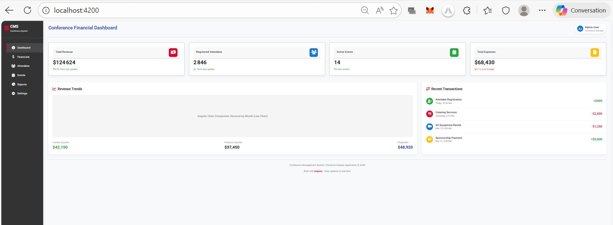
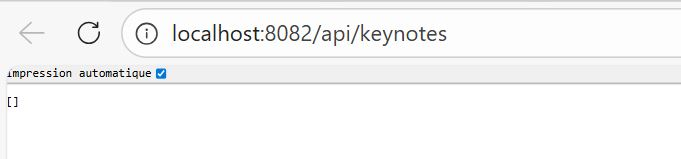
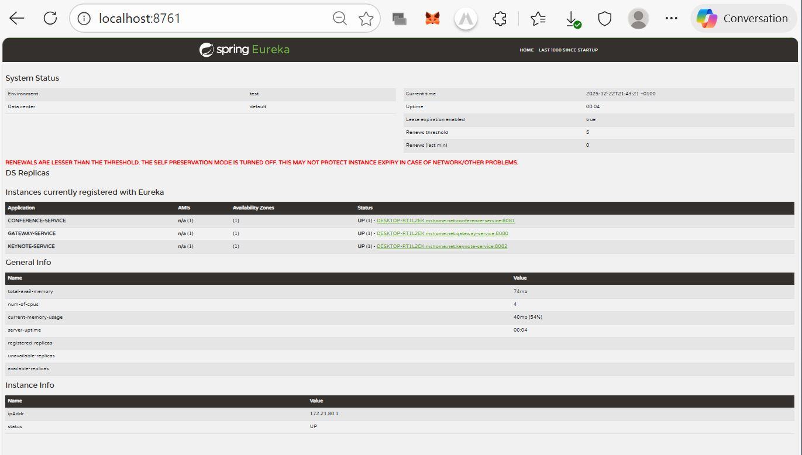
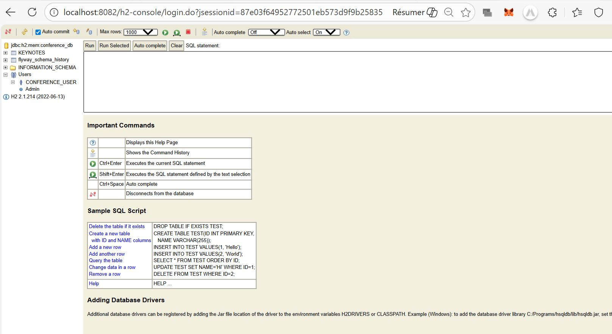

# Conference Management System 🎤

A complete microservices-based conference management system built with **Spring Boot** and **Angular**.

## 📸 Screenshots

*Angular Financial Dashboard*


*Swagger UI for Keynote API*


*Eureka Dashboard - All Services*


*H2 Database Console*

## 🚀 Quick Start
```bash
# With Docker Compose (Recommended)
docker-compose up -d

# Or run services manually
scripts/start-all-services.cmd
cd angular-front-app && ng serve
```

## 🔗 Services & Ports
| Service | Port | URL |
|---------|------|-----|
| Frontend | 4200 | http://localhost:4200 |
| API Gateway | 8080 | http://localhost:8080 |
| Eureka Discovery | 8761 | http://localhost:8761 |
| Conference Service | 8081 | http://localhost:8081 |
| Keynote Service | 8082 | http://localhost:8082 |
| PostgreSQL | 5432 | localhost:5432 |

## 📁 Project Structure
```
conference-management-system/
├── angular-front-app/           # Angular 15 frontend application
│   ├── src/app/
│   │   ├── components/         # UI components (conference-list, keynote-form, etc.)
│   │   ├── services/           # API services
│   │   ├── models/             # TypeScript models
│   │   └── guards/             # Route guards
│   ├── Dockerfile              # Frontend Docker configuration
│   └── nginx.conf              # Nginx configuration
│
├── conference-service/          # Conference management microservice
│   ├── src/main/java/com/conference/conference/
│   │   ├── controller/         # REST controllers
│   │   ├── service/            # Business logic
│   │   ├── repository/         # Data access layer
│   │   ├── entity/             # JPA entities
│   │   ├── dto/                # Data transfer objects
│   │   └── config/             # Configuration classes
│   ├── src/main/resources/db/migration/  # Flyway migrations
│   └── Dockerfile              # Service Docker configuration
│
├── keynote-service/             # Keynote management microservice
│   └── (similar structure to conference-service)
│
├── discovery-service/           # Eureka service discovery
├── config-service/              # Spring Cloud Config server
├── gateway-service/             # API Gateway with routing
│
├── docker/                      # Docker configurations
│   ├── postgres/               # PostgreSQL init scripts
│   └── keycloak/               # Keycloak realm configuration
│
├── scripts/                     # Automation scripts
│   ├── start-all-services.cmd  # Start all services
│   ├── stop-all.cmd            # Stop all services
│   └── check-services.cmd      # Check service status
│
├── docs/                        # Documentation
│   ├── images/                 # Screenshots and diagrams
│   ├── interface-web.md        # Frontend documentation
│   ├── api-documentation.md    # API documentation
│   ├── database-guide.md       # Database guide
│   └── monitoring.md           # Monitoring guide
│
├── docker-compose.yml           # Production Docker Compose
├── docker-compose-dev.yml       # Development Docker Compose
├── pom.xml                      # Parent Maven configuration
├── .env                         # Environment variables
└── README.md                    # This file
```

## 🏗️ Architecture
- **Frontend**: Angular 15+ application
- **Backend**: Spring Boot 3 microservices
- **Service Discovery**: Eureka
- **API Gateway**: Spring Cloud Gateway
- **Database**: PostgreSQL (prod) / H2 (dev)
- **Containerization**: Docker & Docker Compose

## 📚 Documentation
Complete documentation available in [docs/](docs/) directory:
- [Frontend Guide](docs/interface-web.md)
- [API Documentation](docs/api-documentation.md)
- [Database Guide](docs/database-guide.md)
- [Monitoring Guide](docs/monitoring.md)

## 🔧 Prerequisites
- Java 17+
- Node.js 18+
- Docker & Docker Compose
- Maven 3.8+

## 🐳 Docker Commands
```bash
# Build and start all services
docker-compose up --build -d

# View logs
docker-compose logs -f

# Stop services
docker-compose down

# Check status
docker-compose ps
```

## 🧪 Testing
```bash
# Backend tests
mvn test

# Frontend tests
cd angular-front-app && npm test
```

## 🔌 API Endpoints
```http
GET    /api/conferences          # List conferences
POST   /api/conferences          # Create conference
GET    /api/conferences/{id}     # Get conference
GET    /api/keynotes             # List keynotes
POST   /api/keynotes             # Create keynote
GET    /api/keynotes/{id}        # Get keynote
```

## 🚨 Troubleshooting
1. **Services not starting**: Check port availability
2. **Database issues**: Verify PostgreSQL is running
3. **CORS errors**: Configure Angular proxy
4. **Check logs**: `docker-compose logs -f [service-name]`
5. **Health check**: `curl http://localhost:8080/actuator/health`

## 📄 License
MIT License

## 👤 Author
**Wijdaneh** - [GitHub](https://github.com/Wijdaneh)

## ⭐ Support
Give a ⭐️ on [GitHub](https://github.com/Wijdaneh/conference-management-system) if you find this project useful!


